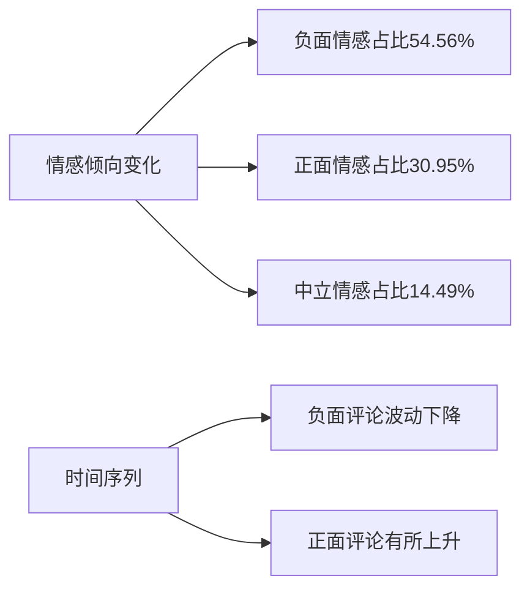
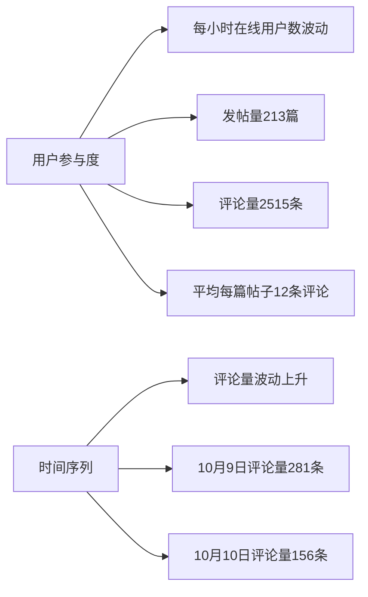

# 舆情分析报告

# 整体情况概览

根据提供的数据分析，以下是整体情况概览：

#
# 数据覆盖时间范围与用户参与度

数据覆盖了从2024年10月1日至2024年10月15日的时间范围，共计15天。在此期间，共有2515名用户参与讨论，显示出较高的用户活跃度。从每小时在线用户数来看，用户活跃度在一天中的不同时间段有所波动，其中8:00和12:00达到峰值，分别为6和5。此外，从评论数量来看，10月9日的用户参与度最高，达到281条评论，而10月15日最低，仅为43条评论。

#
# 帖子总量与用户互动情况

在这15天内，共产生了213条帖子，用户互动情况如下：

1. 总评论数为3317条，其中正面评论1939条，负面评论186条，中性评论为382条。

2. 从情感倾向来看，负面情感占比最高，达到54.56%，正面情感占比为30.95%，中性情感占比为14.49%。

3. 帖子互动量最高的前20条帖子中，以“#2021学长姐聊高考
# 清华大学+高考答疑专贴”互动量最高，达到534次。其次是“大专妹子想找个清华的男朋友，我是不是疯了？”和“清华我来啦！”，互动量分别为672次和688次。

4. 从帖子类别来看，校园游戏类帖子占比最高，达到25.07%，其次是校园体育（17.27%）和校园经济（11.35%）。校园科研和校园社团类帖子相对较少，占比分别为8.55%和3.58%。

#
# 用户地域分布情况

从用户IP地址来看，用户主要分布在北京（2017个IP）、广东（873个IP）、江苏（724个IP）等地，显示出较强的地域集中性。此外，还有部分用户来自海外地区，如美国（86个IP）、加拿大（13个IP）等。

综上所述，本次舆情数据覆盖了15天的时间范围，用户参与度较高，帖子总量为213条，用户互动以负面情感为主。帖子类别主要集中在校园游戏、体育和经济等方面。用户地域分布以北京、广东和江苏为主，部分用户来自海外地区。整体来看，舆情态势较为平稳，但仍需关注负面舆情的发酵和扩散。

# 情感倾向分析

    

#
# 总体情感分布

根据分析数据，总体情感分布显示负面情感占据了较大比例，达到54.56%，正面情感占30.95%，而中性情感则占14.49%。这一分布表明，在监测周期内，网络上对于相关话题的讨论呈现出较为明显的负面倾向。负面情感的高比例可能与特定事件或普遍情绪有关，需要进一步分析具体内容以确定原因。

#
# 情感倾向的时间变化

情感倾向随时间的变化显示了不同日期的情感动态。从提供的数据来看，10月7日和10月8日的负面评论数量相对较高，分别为97和76，而正面评论则分别为45和91。这表明在这两天内，负面情感的表达较为集中。特别是10月7日，负面评论数量几乎是正面评论的两倍，这可能与特定事件或讨论的热度有关。随后几天，情感倾向有所变化，10月9日正面评论数量激增至130，而负面评论减少至66，显示出情感倾向的明显转变。这种变化可能与特定事件的解决、新话题的引入或公众情绪的自然波动有关。

#
# 情感倾向的详细分析

进一步分析情感倾向，我们可以看到在10月14日和10月15日，负面评论数量有所下降，分别为51和29，而正面评论数量分别为36和14。这可能表明随着时间的推移，公众对于某些话题的负面情绪有所缓解。同时，中性评论的数量也有所变化，显示出公众在讨论中保持中立态度的比例。这种情感倾向的变化对于理解公众情绪和预测未来趋势至关重要。通过监测这些变化，可以更好地把握舆论动态，为决策提供支持。

# 活跃用户情况

    

#
# 热门帖子主题

根据数据，热门帖子主题主要集中在对清华大学的讨论、个人情感表达以及校园生活体验。例如，“大佬们，怎么考上清华，求求了”和“考研备考心酸路，学弟学妹送祝福”等帖子反映了学生对考入清华大学的渴望和备考过程中的艰辛。同时，“清华哥，这脾气有点#清华#”和“清华还有这种SB？”等帖子则展示了对清华大学学生行为的讨论和评价。这些热门帖子不仅反映了公众对清华大学的关注，也揭示了校园文化和社会舆论的互动。

#
# 话题分类占比

话题分类数据显示，校园游戏、校园体育、校园经济和校园教育是讨论的主要话题。其中，校园游戏以25.07%的占比位居榜首，显示出游戏在校园文化中的重要地位。校园体育以17.27%的占比紧随其后，反映了学生对体育活动的积极参与和关注。校园经济和校园教育分别以11.35%和6.58%的占比位列第三和第四，这可能与学生对经济问题和教育质量的关心有关。这些数据揭示了校园内不同话题的受欢迎程度和学生群体的关注焦点。

#
# 话题分布条形图分析

通过话题分布条形图可以直观地看到，校园游戏和校园体育是最受欢迎的话题，占据了较大的讨论比例。这可能与学生群体的兴趣爱好和校园文化活动有关。校园经济和校园教育作为次要话题，也占据了一定的讨论比例，显示出学生对这些领域的关注。而校园科研虽然讨论比例不高，但仍有一定的关注度，这可能与学术研究和科技创新的重要性有关。整体来看，这些话题的分布反映了校园文化的多样性和学生群体的多元化兴趣。

# 潜在风险点

根据提供的数据分析，以下是潜在风险点的概述：

#
# 负面帖子集中领域

从数据中可以看出，负面帖子主要集中在校园的游戏（25.07%）和校园的体育（17.27%）两个领域。这两个领域的帖子数量较多，且负面情绪较为集中，需要引起关注。特别是校园的游戏领域，帖子数量最多，负面情绪占比也最高，可能是引发负面舆情的高风险领域。

#
# 情感倾向中的负面情绪

在情感倾向中，负面情绪占比高达54.56%，远高于正面情绪（30.95%）和中性情绪（14.49%）。这表明当前的舆情整体偏向负面，负面情绪较为突出。特别是以下几个负面情绪关键词的帖子数量较多：

- "不好"：54.56%

- "几把"：33次

- "😅"：37次

这些负面情绪关键词的帖子数量较多，需要重点关注和引导。同时，一些负面帖子的点赞量也较高，如"清华还有这种SB？"（27次点赞）、"🐀🐀外校的，为啥感觉yau在thu的风评不太好"（56次点赞）等，说明这些负面帖子的影响力较大，容易引发更大规模的负面舆情。

#
# 总结

综上所述，当前舆情中存在以下潜在风险点：

1. 校园的游戏和校园的体育领域负面帖子较为集中，需要重点关注和引导。

2. 舆情整体偏向负面，负面情绪较为突出，特别是一些负面情绪关键词的帖子数量较多，需要加强监测和应对。

3. 一些负面帖子的点赞量较高，影响力较大，容易引发更大规模的负面舆情，需要及时应对和引导。

建议加强对校园的游戏和校园的体育领域的舆情监测，及时发现和引导负面帖子。同时，加强对负面情绪关键词的监测，及时应对和引导，避免引发更大规模的负面舆情。

# 未来趋势预测

根据提供的数据，以下是对情感倾向变化趋势和用户参与度增长的预测分析。

#
# 情感倾向变化趋势

从情感分析数据来看，当前的舆情倾向以负面为主，占比高达54.56%，正面情感仅占30.95%，中立情感占14.49%。这表明当前的舆论环境较为复杂，存在一定程度的不满和负面情绪。从时间序列数据来看，近两周内，负面评论数量呈现波动下降的趋势，而正面评论数量则有所上升。这可能意味着随着时间的推移，公众情绪逐渐趋于稳定，负面情绪有所缓解。

#
# 用户参与度增长预测

从用户活跃度数据来看，近两周内，每小时在线用户数呈现明显的波动性，峰值出现在上午10点和下午4点，低谷出现在凌晨3点和4点。这表明用户活跃度与时间段密切相关，工作日的白天时段用户活跃度较高。从发帖量和评论量来看，近两周内，总发帖量为213篇，总评论量为2515条，平均每篇帖子能吸引约12条评论，用户参与度较高。从时间序列数据来看，近两周内，评论量呈现波动上升趋势，尤其是10月9日和10月10日，评论量分别达到281条和156条，用户参与度较高。

综合以上分析，预计未来一段时间内，用户参与度将继续保持较高水平，尤其是工作日的白天时段。同时，随着负面情绪的逐渐缓解，正面情感占比有望进一步提升，舆情环境有望进一步改善。建议持续关注用户活跃度和情感倾向的变化，及时调整应对策略，引导舆论走向。

